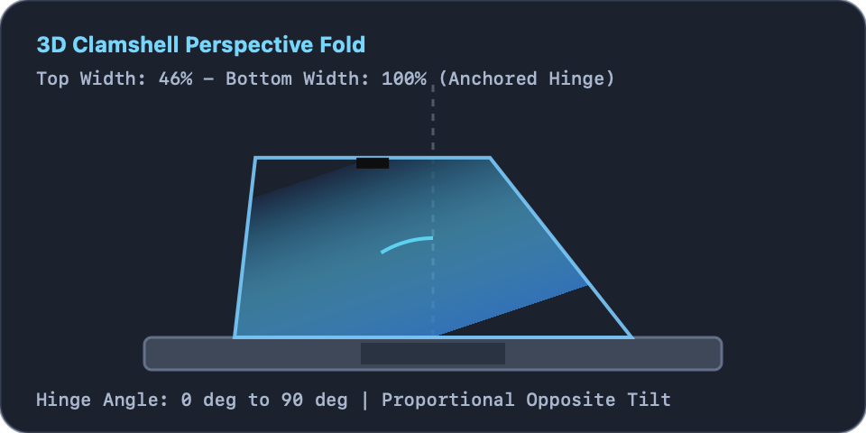
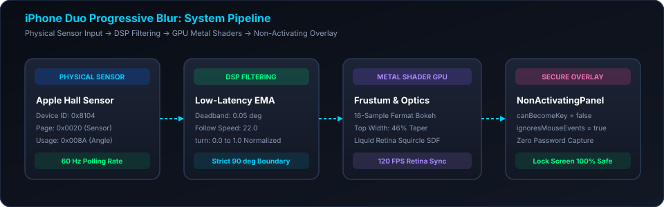
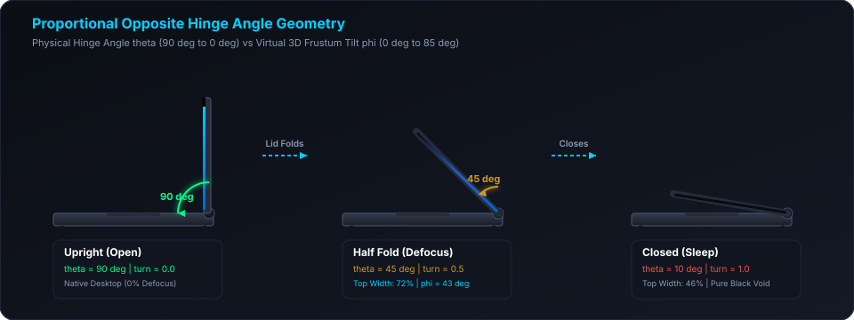
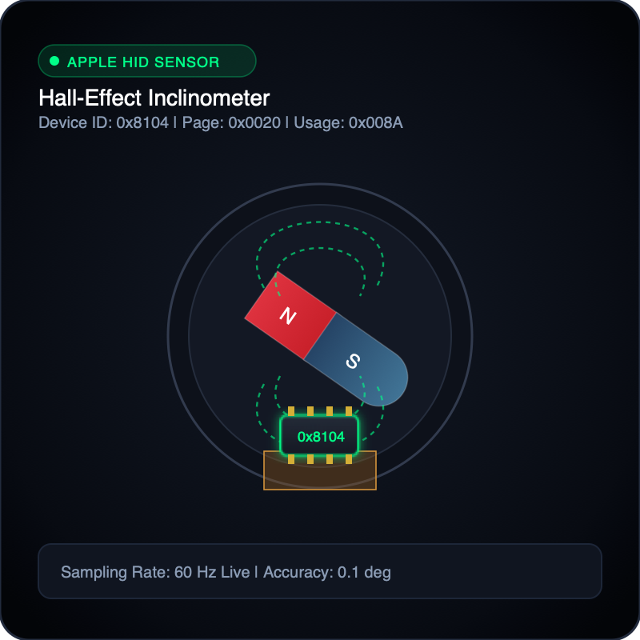
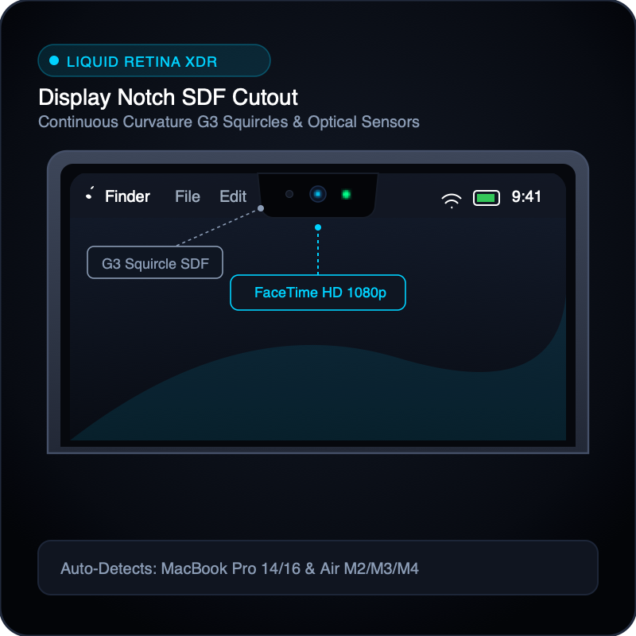
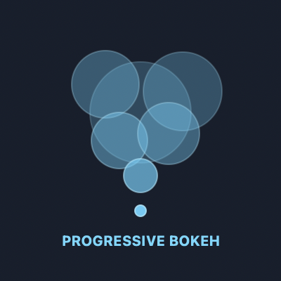

# iPhone Duo Progressive Blur for macOS

Native macOS application recreating the 3D folding display effect of Apple iPhone Duo, physically driven in real time by the MacBook lid and hinge angle sensor.



---

## System Architecture



---

## Direct Download (No Compilation Needed)

Download the pre-built, ready-to-run macOS application:

- **[Download ProgressiveBlur.app (v1.0 Zip)](https://github.com/JenilRevaliya/Progressive-Blur/raw/main/ProgressiveBlur.zip)** (2.6 MB)

### Quick Setup in 3 Steps:
1. Click the download link above to get `ProgressiveBlur.zip`.
2. Double-click `ProgressiveBlur.zip` to extract `ProgressiveBlur.app`.
3. Drag `ProgressiveBlur.app` into your `/Applications` folder and double-click to launch.

---

## If macOS Does Not Allow Opening (Gatekeeper Guide)

When launching an application downloaded outside the Mac App Store, macOS Gatekeeper may display a security alert:
- *"ProgressiveBlur cannot be opened because Apple cannot check it for malicious software"*
- *"ProgressiveBlur was blocked from use because it is not from an identified developer"*
- *"ProgressiveBlur is damaged and cannot be opened"*

This is standard macOS security protection for ad-hoc built software. You can easily permit it using any of the following three methods:

### Option 1: System Settings (Recommended)
1. Open **System Settings** on your Mac.
2. Select **Privacy & Security** from the left sidebar.
3. Scroll down to the **Security** section.
4. You will see: *"ProgressiveBlur was blocked from use because it is not from an identified developer"*.
5. Click **Open Anyway**.
6. Enter your Mac user password or use Touch ID, then click **Open**.

### Option 2: Control-Click Shortcut (Fastest)
1. In Finder, locate `ProgressiveBlur.app` (in Applications or Downloads).
2. Press and hold the **Control** key on your keyboard and click `ProgressiveBlur.app` (or **right-click**).
3. Select **Open** from the context menu.
4. In the dialog box that appears, click **Open**.
5. The application will start, and macOS will remember this approval permanently.

### Option 3: Terminal Command (Instant One-Liner)
If macOS displays an alert saying the app is damaged or blocked, open **Terminal** and run:
```bash
xattr -cr /Applications/ProgressiveBlur.app
```
(If the app is still in your Downloads folder: `xattr -cr ~/Downloads/ProgressiveBlur.app`)

This command strips the quarantine metadata tag and allows immediate execution.

---

## Core Highlights

- **Physical Lid Angle Driving**: Tracks physical lid rotation at 60 Hz via Apple Hall sensor (Vendor 0x05AC, Product 0x8104, Usage Page 0x0020, Usage 0x008A).
- **Authentic iPhone Duo Progressive Blur (Default)**: Full-screen seamless progressive blur with projective perspective mapping, anchored at the bottom hinge.
- **Top Edge Depth Darkening**: Alongside optical defocus blur, the receding top edge darkens gradually into deep shadow, while the bottom edge at the hinge remains 100% bright and razor-sharp Retina.
- **Optional Hardware Hinge Frame**: Off by default. When enabled in Optics settings, displays the MacBook unibody bezel, rounded top corners, and Liquid Retina notch cutout.
- **Ghost-Free 32-Sample Vogel Blur**: Continuous Fermat golden spiral disc with screen-space interleaved gradient micro-dither, eliminating duplicate echoes and banding.
- **Strict 90-Degree Rule**: Zero CPU/GPU overhead at or above 90 degrees. Normal desktop is 100% visible.
- **Lock Screen & Password Login Safe**: Non-activating overlay panel (canBecomeKey = false, ignoresMouseEvents = true). The macOS password prompt receives 100% uninterrupted input focus when opening the lid.
- **Emergency ESC Key Exit**: Pressing Escape immediately dismisses active animations and restores standard desktop display.

---

## Proportional Hinge Perspective Geometry



### The Mathematics

When the MacBook lid rotates downward from 90 degrees toward 0 degrees:
- Physical fold angle: delta = 90 deg - hingeAngle
- Virtual 3D tilt angle: phi = turn * 85.0 deg * perspectiveStrength
- Inverse frustum projection mapping in Metal:
  - denom = eye * cos(phi) - yScreen * sin(phi)
  - v = (yScreen * eye) / denom
  - x = xScreen * (1.0 + (v * sin(phi) * 0.85 * perspectiveStrength) / eye)
- Bottom hinge (v = 0): x = xScreen (100% full width, grounded to keyboard).
- Top edge (v = 1): x is scaled up, narrowing visible display width to 46%.

---

## Lock Screen & Lid Opening Behavior

### How macOS Handles Screen Lock and Sleep
- **Closing the Lid**: As the lid tilts down from 90 degrees to ~15 degrees, the screen remains awake and renders the 3D folding animation. When closed completely (under 2 degrees), macOS initiates sleep and locks the session.
- **Opening the Lid**: When the lid is opened, the display wakes. If the session is locked, macOS displays the secure login window (loginwindow).
- **Password Entry Safety**: Third-party apps cannot and should not intercept lock screen passwords. Our overlay uses a non-activating panel (NSPanel with .nonactivatingPanel, canBecomeKey = false, acceptsFirstResponder = false, ignoresMouseEvents = true).
- **Unfolding on Open**: The overlay displays the unfolding transition smoothly as the lid moves. As soon as the lid reaches 90 degrees, the overlay becomes 100% transparent (alphaValue = 0.0) and pauses rendering, giving the macOS password field immediate, uninterrupted keyboard focus.

---

## Hardware Compatibility Matrix

| MacBook Model Family | Chip Architecture | Lid Sensor Type | Default App Mode |
| :--- | :--- | :--- | :--- |
| **MacBook Pro 14-inch** (2021, 2023, 2024) | M1 Pro/Max, M2, M3, M4 | Continuous Hall Sensor (0x8104) | **Native Hardware Sensor** |
| **MacBook Pro 16-inch** (2021, 2023, 2024) | M1 Pro/Max, M2, M3, M4 | Continuous Hall Sensor (0x8104) | **Native Hardware Sensor** |
| **MacBook Pro 16-inch** (2019) | Intel Core i7 / i9 | Continuous Hall Sensor (0x8104) | **Native Hardware Sensor** |
| **MacBook Air 13-inch & 15-inch** (2022+) | M2, M3, M4 | Continuous Hall Sensor (0x8104) | **Native Hardware Sensor** |
| **MacBook Air 13-inch** (2020) | M1 (MacBookAir10,1) | Binary Reed Switch Only | **Automated Open Sweep / Simulator** |
| **MacBook Pro 13-inch** (2020, 2022) | M1, M2 Legacy Chassis | Binary Reed Switch Only | **Automated Open Sweep / Simulator** |
| **Desktop Macs** | Mac mini, Studio, Pro, iMac | No Clamshell Lid | **Interactive Simulator** |

---

## Controls & Features: What Does What

### 1. Tracking Sources


- **Native Hardware Sensor**: Reads the physical MacBook hinge angle directly from the 0x8104 sensor at 60 Hz. Automatically activates on supported Macs.
- **Option A (Camera Optical Inclinometer)**: Estimates lid tilt angle using the FaceTime HD camera as you move the lid.
- **Option B (Trackpad Haptic Gesture)**: 2-finger vertical drag or pinch on the trackpad with haptic feedback.
- **Option C (Automated Lid Open Sweep)**: Triggers an unfolding sweep whenever the lid opens, wakes, or unlocks. Configurable duration (0.2s to 3.0s) and easing curves (Apple Spring, Ease-Out, Linear).
- **Interactive Manual Simulator**: Real-time slider (0 deg to 120 deg) with quick presets for testing without moving the lid.

### 2. Display Geometry & Hardware Frame


- **iPhone Duo Seamless Mode (Default)**: Full-bleed progressive blur across the entire display without artificial borders or bezel cuts.
- **Simulate Hardware Hinge Frame (Optional)**: Off by default. When enabled, renders the MacBook unibody chassis outline, rounded top corners, and notch cutout.
- **Auto-Detect**: Automatically portrays the camera notch on Liquid Retina MacBooks (M2/M3/M4 Air and 14"/16" Pro).
- **Always Portray**: Simulates the notch cutout, antireflective camera lens, and bezel highlight on any screen.
- **Never Portray**: Flat display boundary for classic non-notch models.

### 3. Optics & Defocus Blur


- **Gradual Top Edge Darkening**: Progressively shadows the receding upper edge as the lid folds downward, anchoring full brightness at the bottom hinge.
- **Blur Multiplier**: Controls the maximum bokeh defocus radius at the far edge.
- **Perspective Depth**: Adjusts the intensity of the 3D trapezoid width taper.
- **Dark Void Horizon**: Controls the gradient falloff into the pitch-black OLED void.
- **Rim Specular Highlight**: Adjusts the glass perimeter reflection as the panel rotates.
- **Filter Responsiveness**: Sets the low-latency filter tracking speed (5.0 to 50.0).

---

## Installation & Build Steps

### Prerequisites
- macOS 14.0 (Sonoma) or macOS 15.0 (Sequoia)
- Apple Silicon (M1, M2, M3, M4) or Intel Mac
- Xcode Command Line Tools (`xcode-select --install`)

### Step 1: Open Project Directory
```bash
cd "/Users/jenilrevaliya/Desktop/Projects/Progressive Blur"
```

### Step 2: Build the Application Bundle
Run the automated build script:
```bash
./build.sh
```
This script will:
1. Compile the Swift release binary (`swift build -c release`).
2. Package the `ProgressiveBlur.app` bundle structure.
3. Bundle `Shaders.metal` and all graphic PNG assets into `Contents/Resources/`.
4. Apply code signing with a persistent designated requirement (`com.antigravity.progressiveblur`) and entitlements.

### Step 3: Launch the Application
```bash
open ProgressiveBlur.app
```
The application will launch with a menu bar item and open the Settings Dashboard.

---

## Deploying to Another MacBook

To test on another MacBook (e.g. MacBook Pro 14"/16" or MacBook Air M2/M3):

### Step 1: Copy the App
Copy or AirDrop `ProgressiveBlur.app` to the target Mac.

### Step 2: Clear Gatekeeper Quarantine (if AirDropped)
On the target Mac, open Terminal and run:
```bash
xattr -cr /path/to/ProgressiveBlur.app
```
Alternatively: Right-click `ProgressiveBlur.app`, hold the Option key, click Open, then click Open in the confirmation dialog.

### Step 3: Automatic Hardware Engagement
When launched on a MacBook with the 0x8104 sensor:
- The app automatically detects the Hall sensor.
- The tracking mode automatically switches to **Native Hardware Sensor**.
- The menu bar displays the live physical angle (for example: 84 deg).

### Step 4: Test Lid Movement
Tilt the lid down below 90 degrees to see the 3D folding animation follow your hands in real time. Open the lid back up to 90 degrees to immediately access the password prompt or desktop.

---

## Keyboard Shortcuts & Quick Actions

- **Escape (ESC)**: Instantly aborts any active animation or fold simulation and restores normal desktop at 90 degrees.
- **0 deg Button**: Previews completely closed state in pure black.
- **30 deg Button**: Previews heavy fold with dramatic perspective taper.
- **60 deg Button**: Previews partial fold state.
- **85 deg Button**: Previews threshold transition point.
- **90 deg Button**: Previews fully open state with zero overlay opacity.

---

## License & Privacy

- 100% on-device and local processing.
- Zero network requests and zero telemetry collection.
- In-memory screen capture with automatic desktop wallpaper fallback.
- MIT License.
